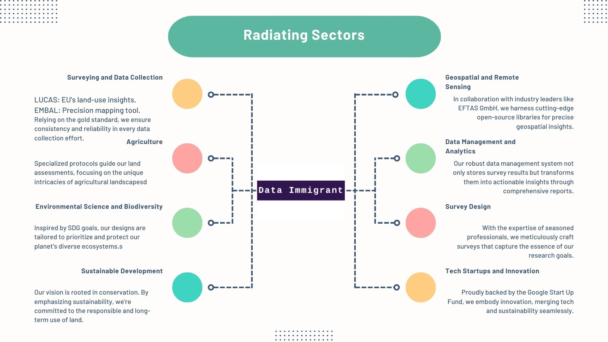

## About

For more context: [Home Site](https://www.dataimmigrant.com/)

<p align="center">
  
</p>

## What we do - Simplified!

Imagine a continent-sized puzzle where each piece represents a fragment of vital information about our planet. From the bustling farms that feed millions to the delicate ecosystems that sustain life, every plot of land tells a story. But to truly understand these tales, we need consistency, precision, and innovation. Let's Explore.

## The Data Immigrant Universe

<p align="center">
  
</p>


We have extended our service offering with a new product, please see the Solution Architecture below: This is all Made possible from Google Start Up Fund. Thank you for supporting our work!

## Recommendation System Architecture on Google Cloud 

a well-detailed architecture of a recommendation system built natively on Google Cloud services. Here's a visual solution architecture to represent the components and their interactions:


```plaintext
+---------------------------------------------------------------+
|                           User Interface                      |
|  +-------------+     +--------------+      +--------------+   |
|  |  Firebase   |<--->| Cloud Pub/Sub|<--->| Recommendation |  |
|  +-------------+     +--------------+     |    Engine      |  |
+---------------------------------------------------------------+

      ^                      ^                     ^
      |                      |                     |
      |                      |                     |
      |                      |                     |
      v                      v                     v
 +-------------+       +-------------+      +-----------------------+
 | Cloud       |       | AI Platform |      | Cloud Firestore/      |
 | Functions   |       | Prediction  |      | Cloud SQL             |
 +-------------+       +-------------+      +-----------------------+
      ^                      ^                     ^
      |                      |                     |
      |                      |                     |
      |                      |                     |
      v                      v                     v
 +-------------+       +-------------+       +-------------+
 | Cloud Pub/  |       | AI Platform |       | Cloud Pub/  |
 | Sub or Data |<----->| Training    |<----->| Sub or Data |
 | flow        |       +-------------+       | flow        |
 +-------------+                              +-------------+

                                |
                                |
                                |
                                v
                           +-------------+
                           | Google App  |
                           | Engine or   |
                           | GKE         |
                           +-------------+


